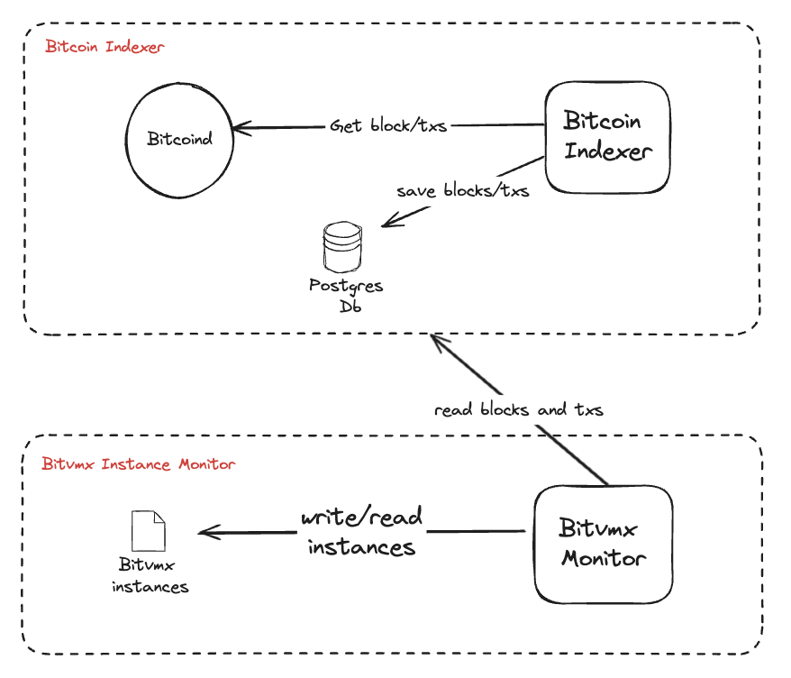

# Bitvmx Instance Monitor


This process checks all BitVMX instances in a file and verifies them against a Bitcoin indexer to ensure that the transactions associated with the BitVMX instances are found in the blockchain.



### Setup `.env` File

To run the monitor, you need to create a **.env** file. You can use the **.env.example** file as a reference.

### Check Possible Envs/Args

```
cargo run -- --help
```